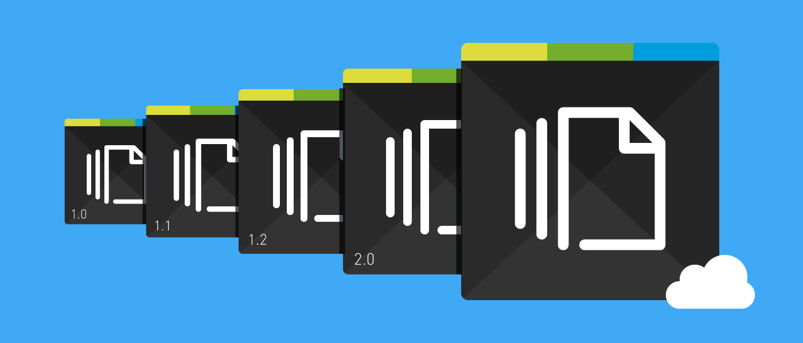

# Version Control Tips

**What is Version Control?**
Version control is a system that helps track changes to files and directories over time. It allows multiple contributors to collaborate on a project, keeping a history of all modifications, and enabling you to revert to previous states if needed. Popular version control systems include Git, Mercurial, and Subversion.

**What is cloning in Git?**
Cloning in Git refers to the process of creating a copy of a Git repository from a remote source, such as GitHub or another Git hosting service, onto your local machine. This copy contains all the project's files, commit history, and branches, enabling you to work on the project locally.

**What is the command to track and stage files?**
To track and stage files in Git, you can use the following command:

**git add** (with the file name)

**What is the command to take a snapshot of your changed files?**

**git commit -m "Your commit message here"*

**What is the command to send your changed files to GitHub?**

*git push origin* with the branch name .
